class: middle, center, title-slide
count: false

# Steps Towards Differentiable and
# Scalable Physics Analyses at the LHC

.huge.blue[Matthew Feickert] 
.huge[(University of Illinois at Urbana-Champaign)]
  
[matthew.feickert@cern.ch](mailto:matthew.feickert@cern.ch)

[Argonne Lunch Seminar](https://indico.fnal.gov/event/46057/)

December 8th, 2020

.middle-logo[]

---
# Collaborators

.grid[
.kol-1-3.center[
.circle.width-40[]

[Lukas Heinrich](https://github.com/lukasheinrich)

CERN
]
.kol-1-3.center[
.circle.width-40[]

[Giordon Stark](https://github.com/kratsg)

UCSC SCIPP
]
.kol-1-3.center[
.circle.width-40[]

[Alexander Held](https://github.com/alexander-held)

NYU
]
]
.grid[
.kol-1-4.center[
.circle.width-45[]

[Nathan Simpson](https://github.com/phinate)

Lund University
]
.kol-1-4.center[
.circle.width-45[]

[Ben Galewsky](https://bengalewsky.github.io/about/)

NCSA/IRIS-HEP
]
.kol-1-4.center[
.circle.width-50[]

[Ricardo Rocha](https://ricardorocha.io/)

CERN
]
.kol-1-4.center[
.circle.width-45[]

[Sinclert Pérez](https://sinclert.github.io/)

NYU
]
]

---
class: focus-slide, center
# Reviewer Note

.huge.bold[If you're reading this before 2020-12-08 these slides might get revised for better clarity, timing, and figure quality]

<!-- ---
class: focus-slide, center
# Goals for today's discussion

.huge.center.bold[Point out some of the ongoing work that you might be interested in]
 
 
 
.huge.center.bold[Show live (toy) example of how easy it can be to get started] -->

---
# Goals of physics analysis at the LHC

.kol-1-1[
.kol-1-3.center[
.width-100[]
Search for new physics
]
.kol-1-3.center[
 
.width-100[]

 
Make precision measurements
]
.kol-1-3.center[
.width-110[]

Provide constraints on models through setting best limits
]
]

- All require .bold[building statistical models] and .bold[fitting models] to data to perform statistical inference
- Model complexity can be huge for complicated searches
- **Problem:** Time to fit can be .bold[literally days]
- .blue[Goal:] Empower analysts with fast fits and expressive models

---
# Automatic Differentiation

.kol-3-5[
- Automatic differentiation (autodiff) provides gradients of numerical functions to machine precision
- Build computational graph of the calculation
- Nodes represent operations, edges represent flow of gradients
- Apply the chain rule to operations

 
$$
f(a,b) = a^{2} \sin(ab)
$$
 
$$
\frac{df}{da} = \frac{\partial c}{\partial a} \frac{\partial f}{\partial c} + \frac{\partial d}{\partial a} \frac{\partial e}{\partial d} \frac{\partial f}{\partial e}
$$

TODO: Revise example with graphviz
]
.kol-2-5.center[
.width-100[[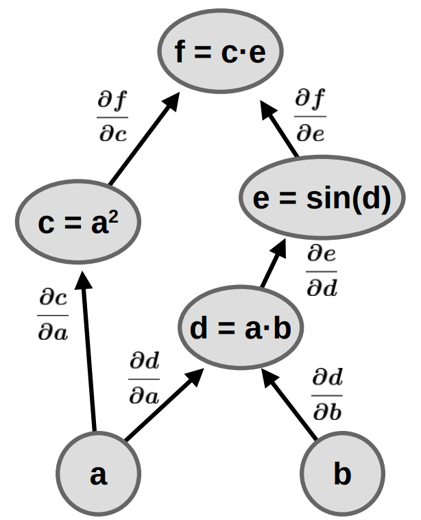](https://indico.cern.ch/event/941278/contributions/4084835/)]
]

---
# Automatic Differentiation: Forward and Reverse

.center[Performing maps $f: \mathbb{R}^{m} \to \mathbb{R}^{n}$]
 
.center[aka, "wide" vs. "tall" transformations]
 
.kol-1-2[
- .bold[Forward] mode
- Column wise evaluation of Jacobian
   - Jacobian-vector products
   - Execution time scales with input parameters
   - Example: few variables into very high dimensional spaces $\mathbb{R} \to \mathbb{R}^{100}$
]
.kol-1-2[
- .bold[Reverse] mode
- Row wise evaluation of Jacobian
   - vector-Jacobian products
   - Execution time scales with output parameters
   - Example: scalar maps from very high-dimensional spaces $\mathbb{R}^{100} \to \mathbb{R}$
]

 
.center[Allows for efficient computation depending on dimensionality]

---
# Differentiable Programming

 

.grid[
.kol-1-2[
- Writing fully differentiable programs
- Replace non-differentiable operations with differentiable analogues
   - binning, sorting, cuts
- Resulting system can be optimized end-to-end using efficient gradient-based optimization algorithms
   - Exploit advances in deep learning
- Enables .italic[efficient] computation of gradients and Jacobians
   - Large benefit to statistical inference
]
.kol-1-2[
.center.width-100[[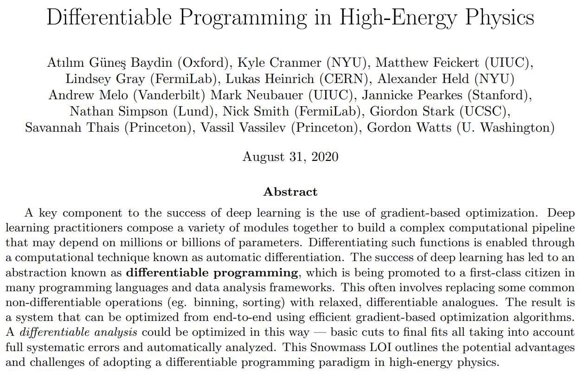](https://www.snowmass21.org/docs/files/summaries/CompF/SNOWMASS21-CompF5_CompF3_Gordon_Watts-046.pdf)]
.center[[Snowmass 2021 LOI](https://www.snowmass21.org/docs/files/summaries/CompF/SNOWMASS21-CompF5_CompF3_Gordon_Watts-046.pdf)]
]
]

---
class: focus-slide, center
# Case study: Autodiff improving analyses

.huge.bold.center[Application of autodiff in `pyhf`]

---
# HistFactory Model

- A flexible probability density function (p.d.f.) template to build statistical models in high energy physics
- Developed in 2011 during work that lead to the Higgs discovery [[CERN-OPEN-2012-016](http://inspirehep.net/record/1236448)]
- Widely used by the HEP community for .bold[measurements of known physics] (Standard Model) and  .bold[searches for new physics] (beyond the Standard Model)

.kol-2-5.center[
.width-90[[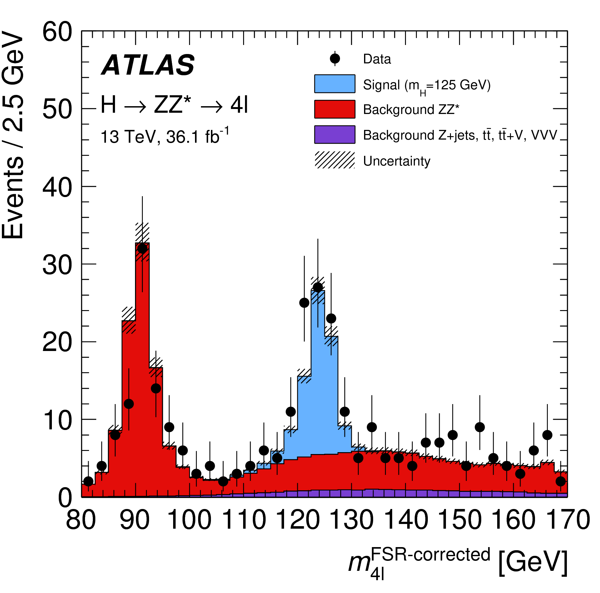](https://atlas.web.cern.ch/Atlas/GROUPS/PHYSICS/PAPERS/HIGG-2016-25/)]
.bold[Standard Model]
]
.kol-3-5.center[
.width-100[]
.bold[Beyond the Standard Model]
]

---
# HistFactory Template

$$
f\left(\mathrm{data}\middle|\mathrm{parameters}\right) =  f\left(\vec{n}, \vec{a}\middle|\vec{\eta}, \vec{\chi}\right) = \color{blue}{\prod\_{c \\,\in\\, \textrm{channels}} \prod\_{b \\,\in\\, \textrm{bins}\_c} \textrm{Pois} \left(n\_{cb} \middle| \nu\_{cb}\left(\vec{\eta}, \vec{\chi}\right)\right)} \\,\color{red}{\prod\_{\chi \\,\in\\, \vec{\chi}} c\_{\chi} \left(a\_{\chi}\middle|\chi\right)}
$$

.bold[Use:] Multiple disjoint _channels_ (or regions) of binned distributions with multiple _samples_ contributing to each with additional (possibly shared) systematics between sample estimates

.kol-1-2[
.bold[Main pieces:]
- .blue[Main Poisson p.d.f. for simultaneous measurement of multiple channels]
- .katex[Event rates] $\nu\_{cb}$ (nominal rate $\nu\_{scb}^{0}$ with rate modifiers)
- .red[Constraint p.d.f. (+ data) for "auxiliary measurements"]
   - encode systematic uncertainties (e.g. normalization, shape)
- $\vec{n}$: events, $\vec{a}$: auxiliary data, $\vec{\eta}$: unconstrained pars, $\vec{\chi}$: constrained pars
]
.kol-1-2[
.center.width-100[]
.center[Example: .bold[Each bin] is separate (1-bin) _channel_,  each .bold[histogram] (color) is a _sample_ and share  a .bold[normalization systematic] uncertainty]
]

---
# HistFactory Template

$$
f\left(\vec{n}, \vec{a}\middle|\vec{\eta}, \vec{\chi}\right) = \color{blue}{\prod\_{c \\,\in\\, \textrm{channels}} \prod\_{b \\,\in\\, \textrm{bins}\_c} \textrm{Pois} \left(n\_{cb} \middle| \nu\_{cb}\left(\vec{\eta}, \vec{\chi}\right)\right)} \\,\color{red}{\prod\_{\chi \\,\in\\, \vec{\chi}} c\_{\chi} \left(a\_{\chi}\middle|\chi\right)}
$$

Mathematical grammar for a simultaneous fit with

- .blue[multiple "channels"] (analysis regions, (stacks of) histograms)
- each region can have .blue[multiple bins]
- coupled to a set of .red[constraint terms]

.center[.bold[This is a _mathematical_ representation!] Nowhere is any software spec defined]
.center[.bold[Until now] (2018), the only implementation of HistFactory has been in [`ROOT`](https://root.cern.ch/)]

.bold[`pyhf`: HistFactory in pure Python]
.center.width-40[]

---
# `pyhf`: HistFactory in pure Python
<!--  -->
.kol-1-2.width-95[
- First non-ROOT implementation of the HistFactory p.d.f. template
   - .width-40[]
- pure-Python library as second implementation of HistFactory
  - [`$ pip install pyhf`](https://scikit-hep.org/pyhf/installation.html#install-from-pypi)
  - No dependence on ROOT!
]
.kol-1-2.center[
.width-60[]
]
<!--  -->
.kol-1-1[
- Open source tool for all of HEP
   - [IRIS-HEP](https://iris-hep.org/projects/pyhf.html) supported Scikit-HEP project
   - Used for reinterpretation in phenomenology paper (DOI: [10.1007/JHEP04(2019)144](https://inspirehep.net/record/1698425)) and `SModelS`
   - Used in ATLAS SUSY groups and for internal pMSSM SUSY large scale reinterpretation
   - Maybe your experiment too!
]

---
# Machine Learning Frameworks for Computation

.grid[
.kol-2-3[
- All numerical operations implemented in .bold[tensor backends] through an API of $n$-dimensional array operations
- Using deep learning frameworks as computational backends allows for .bold[exploitation of auto differentiation (autodiff) and GPU acceleration]
- As huge buy in from industry we benefit for free as these frameworks are .bold[continually improved] by professional software engineers (physicists are not)

.kol-1-2.center[
.width-90[]
]
.kol-1-2[
 
- Show hardware acceleration giving .bold[order of magnitude speedup] for some models!
- Improvements over traditional
   - 10 hrs to 30 min; 20 min to 10 sec
]
]
.kol-1-4.center[
.width-85[]
.width-85[]
.width-85[]

 
.width-50[]
]
]

---
# Automatic differentiation

With tensor library backends gain access to _exact (higher order) derivatives_ &mdash; accuracy is only limited by floating point precision

$$
\frac{\partial L}{\partial \mu}, \frac{\partial L}{\partial \theta_{i}}
$$

.grid[
.kol-1-2[
.large[Exploit .bold[full gradient of the likelihood] with .bold[modern optimizers] to help speedup fit!]

  
.large[Gain this through the frameworks creating _computational directed acyclic graphs_ and then applying the chain rule (to the operations)]
]
.kol-1-2[
.center.width-80[]
]
]

---
# HEP Example: Likelihood gradients

.footnote[Example adapted from [Lukas Heinrich's PyHEP 2020 tutorial](https://indico.cern.ch/event/882824/timetable/#45-introduction-to-automatic-d)]

.kol-1-2.center[
.width-90[]
]
.kol-1-2.center[
.width-90[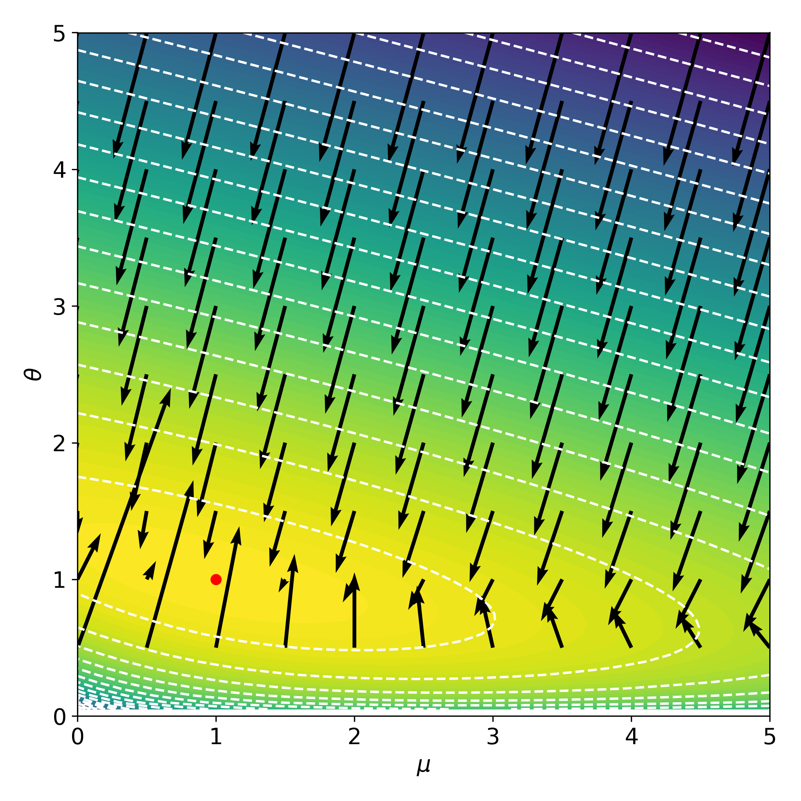]
]

.bold.center[Having access to the gradients makes the fit orders of magnitude faster than finite difference]

---
# HEP Example: Likelihood gradients

.footnote[Example adapted from [Lukas Heinrich's PyHEP 2020 tutorial](https://indico.cern.ch/event/882824/timetable/#45-introduction-to-automatic-d)]

.kol-1-2.center[
.width-90[]
]
.kol-1-2.center[
.width-90[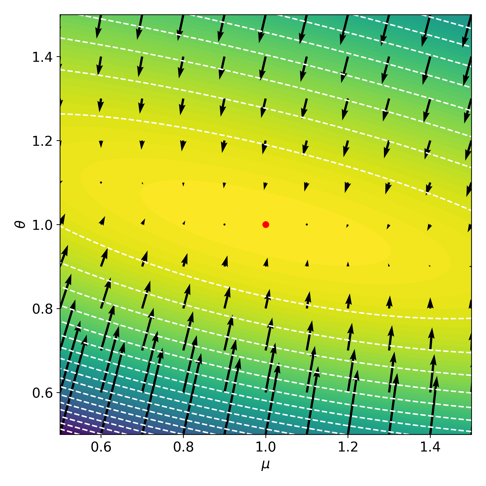]
]

.bold.center[Having access to the gradients makes the fit orders of magnitude faster than finite difference]

---
class: focus-slide, center
# Enable new techniques with autodiff

.huge.bold.center[Familiar (toy) example: Optimizing a cut for an analysis]

---
# Discriminate signal and background

- Counting experiment for presence of signal process
- Place discriminate cut on observable $x$ to maximize significance
   - Significance: $\sqrt{2 (S+B) \log(1 + \frac{S}{B})-2S}$ (for small $S/B$: significance $\to S/\sqrt{B}$)

.footnote[Example inspired by Alexander Held's [example of a differentiable analysis](https://github.com/alexander-held/differentiable-analysis-example/)]

.kol-1-2.center[
.width-100[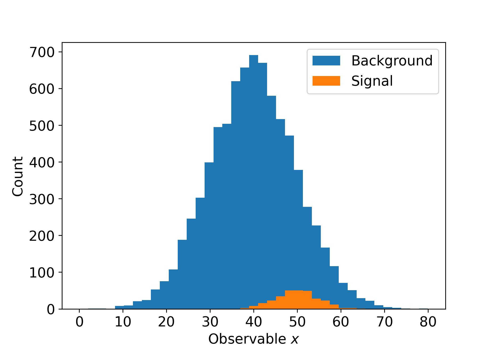]
]
.kol-1-2.center[
.width-100[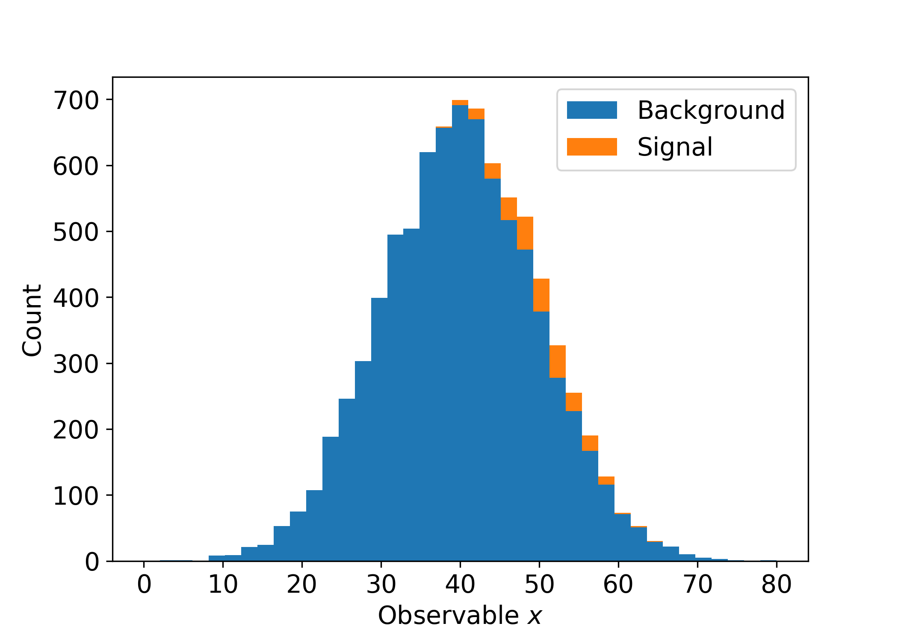]
]

---
# Traditionally: Scan across cut values

- Set baseline cut at $x=0$ (accept everything)
- Step along cut values in $x$ and calculate significance at each cut. Keep maximum.

.kol-1-2.center[
.width-100[]
]
.kol-1-2[
.width-100[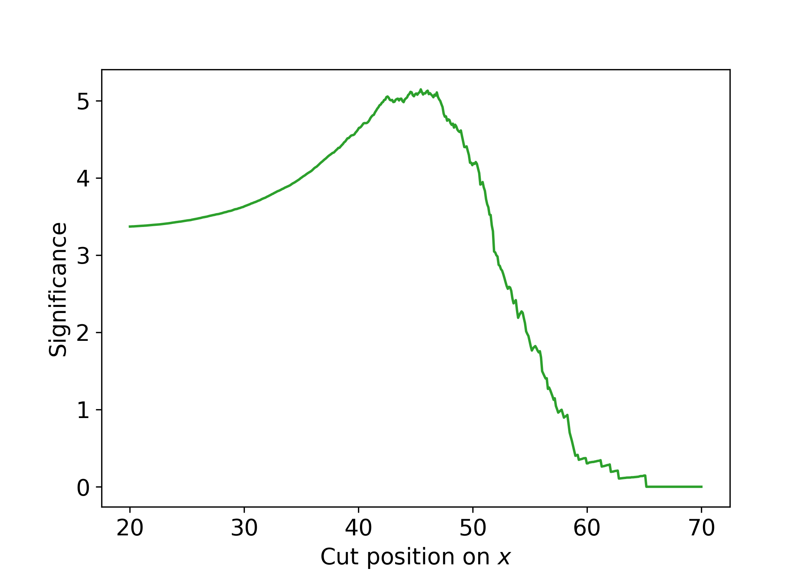]
]

.center[Significance: $\sqrt{2 (S+B) \log(1 + \frac{S}{B})-2S}$]

---
# Differentiable approach

 

.kol-1-2[
- Need differentiable analogue to non-differentiable cut
- Weight events using activation function of sigmoid

.center[$\left(1 + e^{-\alpha(x-c)}\right)^{-1}$]

- $\alpha$ tunable parameter for steepness
- Event far .italic[below] cut: $w \to 0$
- Event far .italic[above] cut: $w \to 1$
]
.kol-1-2[
.width-100[]
]

---
# Compare hard cuts vs. differentiable

 

.kol-1-2[
- For hard cuts the significance was calculated by applying the cut and than using the remaining $S$ and $B$ events
- But for the differentiable model there aren't cuts, so approximate cuts with the sigmoid approach and weights
- Comparing the two methods shows good agreement
- Can see that the approximation to the hard cuts improves with larger $\alpha$
   - But can become unstable, so tunable
]
.kol-1-2.center[
.width-100[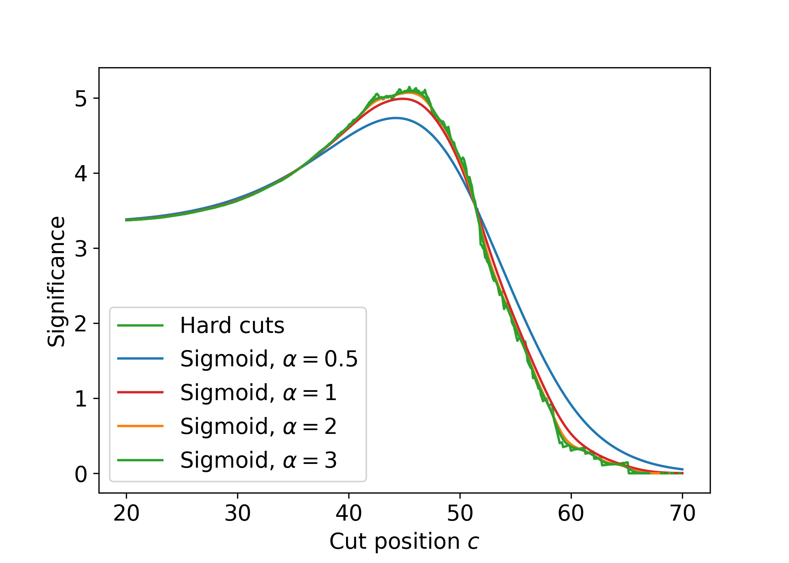]
]

---
# Compare hard cuts vs. differentiable

 

.kol-1-2[
- For hard cuts the significance was calculated by applying the cut and then using the remaining $S$ and $B$ events
- But for the differentiable model there aren't cuts, so approximate cuts with the sigmoid approach and weights
- Comparing the two methods shows good agreement
- Can see that the approximation to the hard cuts improves with larger $\alpha$
   - But can become unstable, so tunable
]
.kol-1-2.center[
.width-100[]
]

---
# Accessing the gradient

.kol-2-5[
  
- Most importantly though, with the differentiable model we have access to the gradient
   - $\partial_{x} f(x)$
- So can find the maximum significance at the point where the gradient of the significance is zero
   - $\partial_{x} f(x) = 0$
- With the gradient in hand this cries out for automated optimization!
]
.kol-3-5.center[
.width-90[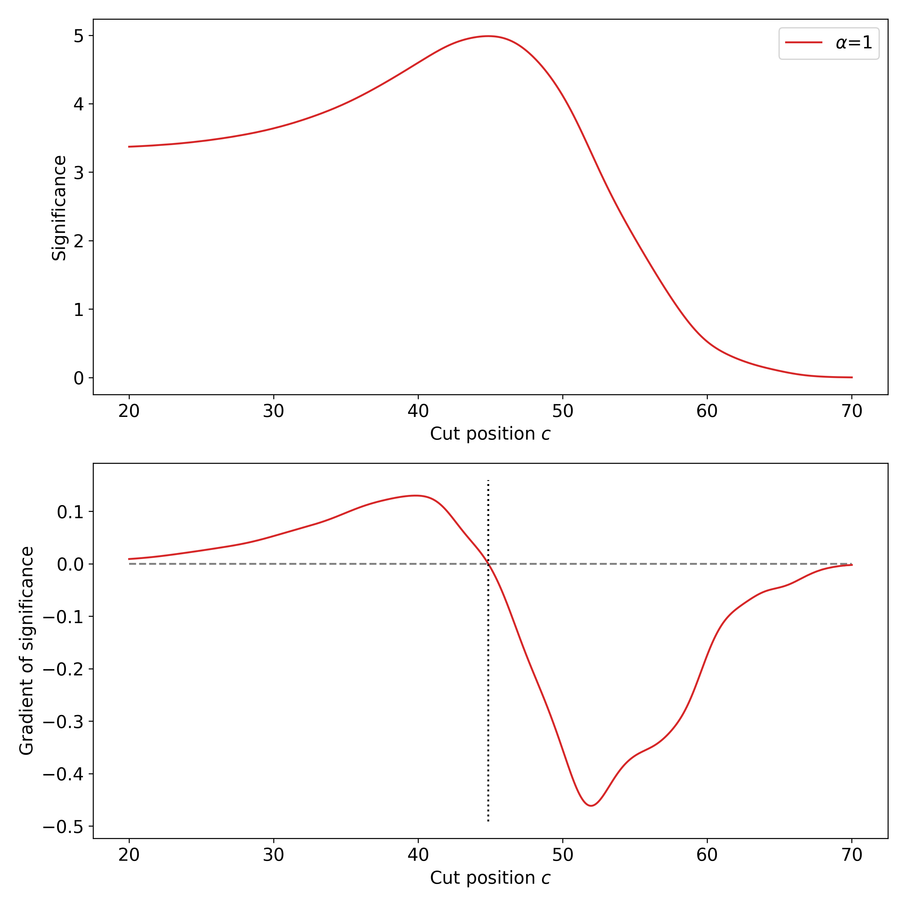]
]

---
# Automated optimzation

.kol-2-5[
  
- With a simple gradient descent algorithm can easily automate the significance optimization
- For this toy example, obviously less efficient then cut and count scan
- Gradient methods apply well in higher dimensional problems
- Allows for the cut to become a tunable parameter of the larger analysis
]
.kol-3-5.center[
.width-100[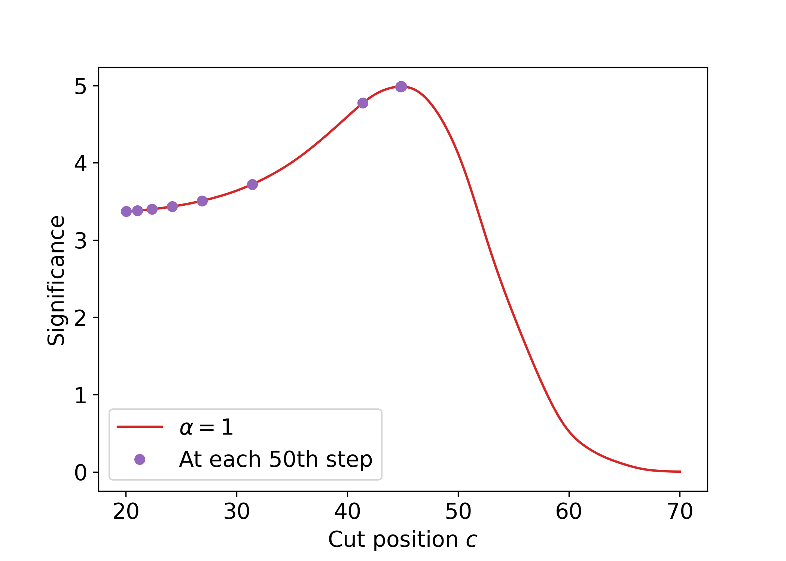]

TODO: Make this an animated GIF
]

---
# New art: analysis as a differentiable program
.kol-1-2[
- Provide differentiable analogue to histograms with kernel density estimation or softmax
   - Need smooth change compares to abrupt changes in binned yields
<!-- - Make profile-likelihood differentiable with [fixed-point differentiation](https://implicit-layers-tutorial.org/implicit_functions/) -->
- Samples fed into NN that produces observable (NN output) that can be binned.
- Construct `pyhf` model with observable and perform inference to get $CL_s$ for POI.
- Backpropagate the $CL_s$ to update weights for NN.

 
.center.width-40[]
.footnote[Graphics from [Nathan Simpson's PyHEP 2020 talk](https://indico.cern.ch/event/882824/timetable/#46-neos-physics-analysis-as-a)]
]
.kol-1-2.center[
.width-40[]
.width-100[]
]

---
# New art: analysis as a differentiable program

.center[`neos` 3 bin observable (NN output) with KDE optimized with systematics w.r.t. $\mathrm{CL}_{s}$]
.center.width-100[]

.kol-1-3[
- 3 regions are decision boundaries of NN output
- 3 bins $\to$ 3 regions
]
.kol-1-3[
- $\mathrm{CL}_{s}$ value minimized as goal of NN
]
.kol-1-3[
- Observations in NN output
   - $0$: Background-like
   - $1$: Signal-like
- Binned contents channel input for `pyhf` model
]

---
# Differentiable ecosystem

.kol-1-3.center[
.width-100[]

gradhep
]
.kol-1-3.center[
.width-100[]

[neos](https://github.com/gradhep/neos), [INFERNO](https://inspirehep.net/literature/1677673)
]
.kol-1-3.center[
  
.width-100[[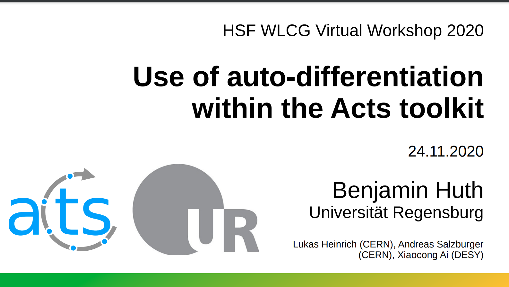](https://indico.cern.ch/event/941278/contributions/4084835/)]

   
ACTS
]

 
.kol-1-1[
.bold.center[Groups, libraries, and applications growing rapidly]
]

---
class: focus-slide, center
# Scalable solutions

.huge.bold.center[Differentiable analyses at LHC scale]

---
# Analysis Systems through lens of stat inference

.center.width-80[]

- Accelerating fitting (reducing time to insight (statistical inference)!)
- [Analysis Systems](https://iris-hep.org/as.html) pipeline has beta infrastructure for the final statistical inference stages with [`pyhf`](https://scikit-hep.org/pyhf/) + [`cabinetry`](https://iris-hep.org/projects/cabinetry.html)

---
# Fitting as a Service with `pyhf`
.kol-1-2[
  
- Want to leverage `pyhf` hardware accelerated backends at HPC sites for real analysis speedup
   - Fitting time from hours to minutes
- HTC not target, so deploy (fitting) Function as a Service (FaaS)
   - Use API to deploy fits and return JSON output
]
.kol-1-2[
.center.width-100[]
.center[ATLAS workspace that takes over an hour on ROOT fit in under 2 minutes with `pyhf` on GPU]
]

---
# Open fields of exploration

.kol-1-2[
 
- Early days in exploring solutions to implementation of Fitting as a Service
- Parallel explorations of what service and user API would look like
- [funcX](https://funcx.readthedocs.io/en/latest/index.html) from [Globus Labs](https://labs.globus.org/projects/funcx.html)
   - High-performance FaaS platform
   - Allows users to register and then execute Python functions in "serverless supercomputing" workflow
- [Knative](https://knative.dev/)
   - [Well adopted](https://youtu.be/69OfdJ5BIzs) as a Serverless/FaaS solution on Kubernetes
   - Deployment model promotes efficient resource usage and simplifies bursting
]
.kol-1-2[
.center.width-100[]
.center.width-60[]
]

---
# Infrastructure Perspective

.center.width-100[]
 
.center[Possible workflow for development (here for funcX) and end user experience]

---
# Infrastructure Perspective

.center.width-100[]
 
- funcX can be deployed to Kubernetes, HTCondor, SLURM, and most other popular HTC environments
- Kubernetes assumes containers (containerd, Docker), but the other environments can just use conda or pip

---
# funcX example: Distributed fitting
.kol-1-2[
- [Prototype workflow](https://github.com/BenGalewsky/fitting-as-a-service) for fitting models from `pyhf` pallet for [published ATLAS SUSY 1Lbb analysis](https://www.hepdata.net/record/ins1755298)
   - Currently deployed on [Chicago River HPC cluster](https://indico.cern.ch/event/960587/contributions/4070332/)
   - Example implementation of deployment model
- Uses Python driver with Globus Auth Groups for authentication
- Able to fit all models in analysis (125 signal patches) in just over .bold[2 minutes]
   - .bold[N.B.] Wall time includes downloading `pyhf` pallet from HEPData, starting funcX, sending data to funcX, and fits
- Currently CPU, but parallelization gives significant speedup
 - For working prototype, this is already a win!
- Investigating GPU workflows for pseudoexperiment generation that benefit from hardware acceleration
]
.kol-1-2[
.center.width-70[]
]

---
# Knative + GPU Workloads

- CERN colleagues built prototype scaling out from CERN to Google Cloud Platform (GCP)
   - Especially interesting for GPUs/TPUs
- Supports fast auto scaling of workloads (secs) and clusters (mins) to meet demand
- Working on version that allows per second reporting instead of per script execution
.grid[
.kol-1-2[
.center.width-100[]
]
.kol-1-2[
.center.width-100[]
.center[[Example toy fit](https://gist.github.com/lukasheinrich/494b68ccb48b9ba97499fc113fd2dbe5) run on all [available GCP cards](https://cloud.google.com/compute/docs/gpus)]
]
]

---
# Knative + GPU Workloads

- CERN colleagues built prototype scaling out from CERN to Google Cloud Platform (GCP)
   - Especially interesting for GPUs/TPUs
- Supports fast auto scaling of workloads (secs) and clusters (mins) to meet demand
- Working on version that allows per second reporting instead of per script execution
.grid[
.kol-1-2[
.center.width-100[]
]
.kol-1-2[
.center.width-100[]
]
]

---
# Metadiff

.kol-1-3[
- Real world high energy physics analyses have various challenges:
   - Computations highly complex chains
   - Not implementable in a single framework
   - Asynchronous multi-step procedures
   - Strong need for distributed computing
- "Metadiff" allows for passing of gradients .bold[between] different implementations and services
- Possible solution to allow for distributed computations at scale exploiting gradients
]
.kol-2-3.center[
.width-100[[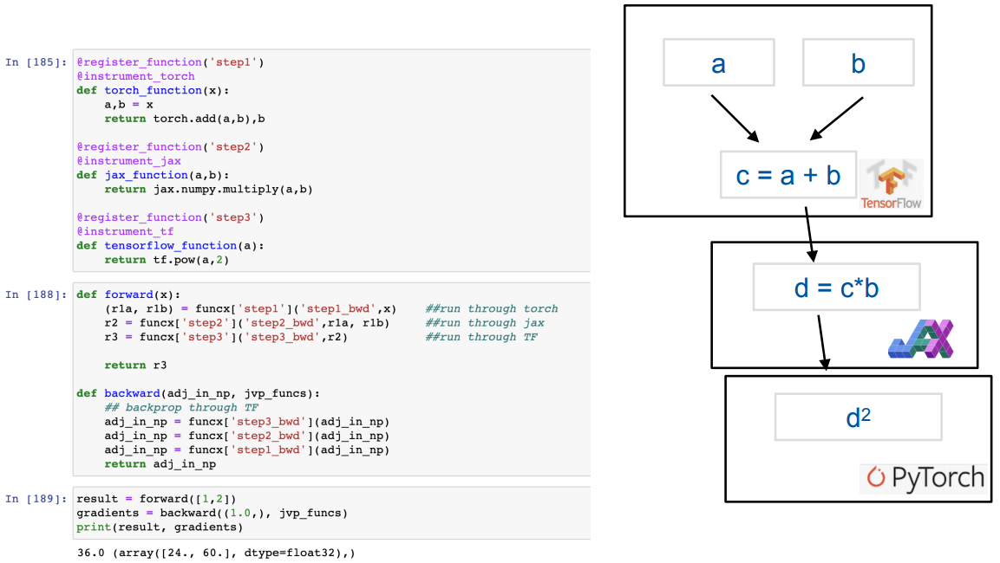](https://indico.cern.ch/event/960587/contributions/4070325/)]
  
Differentiating through PyTorch, JAX, and TensorFlow using FaaS
]

---
# Summary

- Automatic differentiation gives a powerful tool in the form of differentiable programming
   - Exploitation of .bold[gradient for optimization]
   - .bold[End-to-end optimization] of systems and analyses
- Scalable workflows are a requirement for LHC scale analyses
   - Distributed .bold[Functions as a Service] offer powerful scaling
   - Heterogeneous architectures can be employed
   - Metadiff can allow for differentiating through systems using FaaS
- Ongoing areas of rapid work in IRIS-HEP, gradhep, and CERN
   - Growing .bold[ecosystem] of work and tools

.kol-1-2.center[
.width-45[]
]
.kol-1-2.center[
.width-70[]
]

---
class: end-slide, center

.large[Backup]

---
# HistFactory Template

$$
f\left(\mathrm{data}\middle|\mathrm{parameters}\right) =  f\left(\vec{n}, \vec{a}\middle|\vec{\eta}, \vec{\chi}\right) = \color{blue}{\prod\_{c \\,\in\\, \textrm{channels}} \prod\_{b \\,\in\\, \textrm{bins}\_c} \textrm{Pois} \left(n\_{cb} \middle| \nu\_{cb}\left(\vec{\eta}, \vec{\chi}\right)\right)} \\,\color{red}{\prod\_{\chi \\,\in\\, \vec{\chi}} c\_{\chi} \left(a\_{\chi}\middle|\chi\right)}
$$

.bold[Use:] Multiple disjoint _channels_ (or regions) of binned distributions with multiple _samples_ contributing to each with additional (possibly shared) systematics between sample estimates

.kol-1-2[
.bold[Main pieces:]
- .blue[Main Poisson p.d.f. for simultaneous measurement of multiple channels]
- .katex[Event rates] $\nu\_{cb}$ (nominal rate $\nu\_{scb}^{0}$ with rate modifiers)
- .red[Constraint p.d.f. (+ data) for "auxiliary measurements"]
   - encode systematic uncertainties (e.g. normalization, shape)
- $\vec{n}$: events, $\vec{a}$: auxiliary data, $\vec{\eta}$: unconstrained pars, $\vec{\chi}$: constrained pars
]
.kol-1-2[
.center.width-100[]
.center[Example: .bold[Each bin] is separate (1-bin) _channel_,  each .bold[histogram] (color) is a _sample_ and share  a .bold[normalization systematic] uncertainty]
]

---
# HistFactory Template

$$
f\left(\vec{n}, \vec{a}\middle|\vec{\eta}, \vec{\chi}\right) = \color{blue}{\prod\_{c \\,\in\\, \textrm{channels}} \prod\_{b \\,\in\\, \textrm{bins}\_c} \textrm{Pois} \left(n\_{cb} \middle| \nu\_{cb}\left(\vec{\eta}, \vec{\chi}\right)\right)} \\,\color{red}{\prod\_{\chi \\,\in\\, \vec{\chi}} c\_{\chi} \left(a\_{\chi}\middle|\chi\right)}
$$

Mathematical grammar for a simultaneous fit with

- .blue[multiple "channels"] (analysis regions, (stacks of) histograms)
- each region can have .blue[multiple bins]
- coupled to a set of .red[constraint terms]

.center[.bold[This is a _mathematical_ representation!] Nowhere is any software spec defined]
.center[.bold[Until recently] (2018), the only implementation of HistFactory has been in [`ROOT`](https://root.cern.ch/)]

.bold[`pyhf`: HistFactory in pure Python]
.center.width-40[]

---
# What is `pyhf`?

Please checkout the many resources we have starting with the [website](https://scikit-hep.org/pyhf/) and the [SciPy 2020 talk](https://youtu.be/FrH9s3eB6fU)!

<!--  -->

.grid[
.kol-1-3.center[
.width-60[]
]
.kol-1-3.center[
 
.width-60[]
]
.kol-1-3.center[
 
.width-70[]
]
]
---
# References

1. Lukas Heinrich, .italic[[Distributed Gradients for Differentiable Analysis](https://indico.cern.ch/event/960587/contributions/4070325/)], [Future Analysis Systems and Facilities Workshop](https://indico.cern.ch/event/960587/), 2020.

---
# References

1. F. James, Y. Perrin, L. Lyons, .italic[[Workshop on confidence limits: Proceedings](http://inspirehep.net/record/534129)], 2000.
2. ROOT collaboration, K. Cranmer, G. Lewis, L. Moneta, A. Shibata and W. Verkerke, .italic[[HistFactory: A tool for creating statistical models for use with RooFit and RooStats](http://inspirehep.net/record/1236448)], 2012.
3. L. Heinrich, H. Schulz, J. Turner and Y. Zhou, .italic[[Constraining $A_{4}$ Leptonic Flavour Model Parameters at Colliders and Beyond](https://inspirehep.net/record/1698425)], 2018.
4. A. Read, .italic[[Modified frequentist analysis of search results (the $\\mathrm{CL}_{s}$ method)](http://cds.cern.ch/record/451614)], 2000.
5. K. Cranmer, .italic[[CERN Latin-American School of High-Energy Physics: Statistics for Particle Physicists](https://indico.cern.ch/event/208901/contributions/1501047/)], 2013.
6. ATLAS collaboration, .italic[[Search for bottom-squark pair production with the ATLAS detector in final states containing Higgs bosons, b-jets and missing transverse momentum](http://inspirehep.net/record/1748602)], 2019
7. ATLAS collaboration, .italic[[Reproducing searches for new physics with the ATLAS experiment through publication of full statistical likelihoods](https://cds.cern.ch/record/2684863)], 2019
8. ATLAS collaboration, .italic[[Search for bottom-squark pair production with the ATLAS detector in final states containing Higgs bosons, b-jets and missing transverse momentum: HEPData entry](https://www.hepdata.net/record/ins1748602)], 2019

---

class: end-slide, center
count: false

The end.
