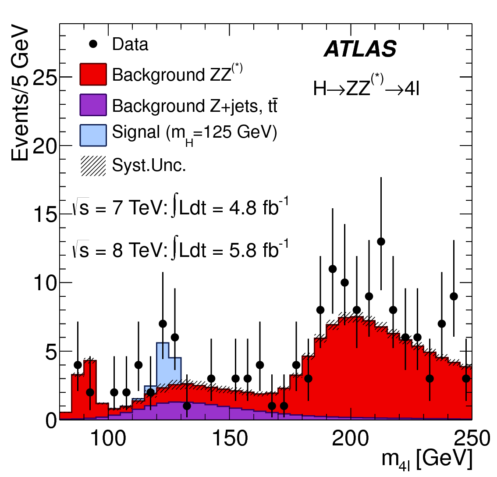
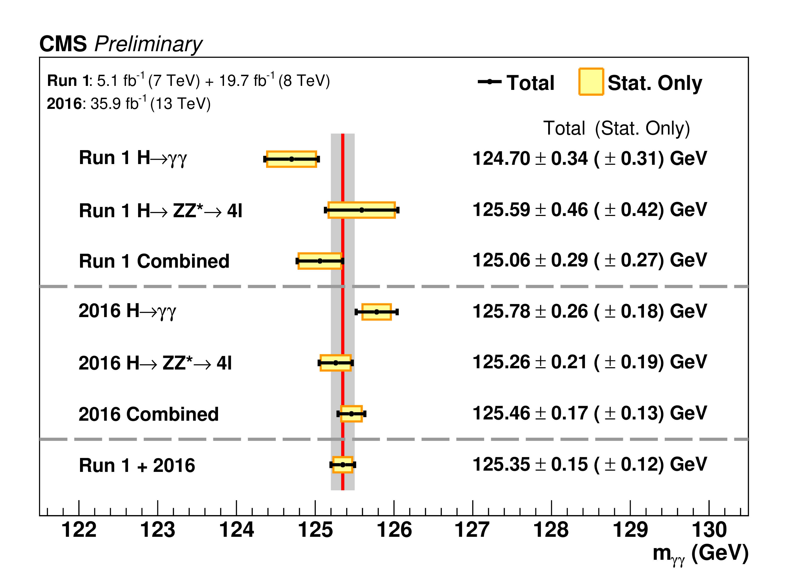

class: middle, center, title-slide
count: false

# Steps Towards Differentiable and
# Scalable Physics Analyses at the LHC

.huge.blue[Matthew Feickert] 
.huge[(University of Illinois at Urbana-Champaign)]
  
[matthew.feickert@cern.ch](mailto:matthew.feickert@cern.ch)

[Argonne Lunch Seminar](https://indico.fnal.gov/event/46057/)

December 8th, 2020

.middle-logo[]

---
# Collaborators

.grid[
.kol-1-3.center[
.circle.width-40[]

[Lukas Heinrich](https://github.com/lukasheinrich)

CERN
]
.kol-1-3.center[
.circle.width-40[]

[Giordon Stark](https://github.com/kratsg)

UCSC SCIPP
]
.kol-1-3.center[
.circle.width-35[]

[Kyle Cranmer](http://theoryandpractice.org/)

NYU
]
]
.grid[
.kol-1-4.center[
.circle.width-45[]

[Mark Neubauer](https://github.com/lukasheinrich)

Illinois
]
.kol-1-4.center[
.circle.width-45[]

[Sabine Kraml](http://www.kraml.net/)

LPSC, Grenoble
]
.kol-1-4.center[
.circle.width-45[]

[Wolfgang Waltenberger](https://github.com/WolfgangWaltenberger)

HEPHY ÖAW
]
.kol-1-4.center[
.circle.width-45[]

[Gaël Alguero](https://github.com/Ga0l)

LPSC, Grenoble
]
]

---
class: focus-slide, center
# Goals for today's discussion

.huge.center.bold[Open and reusable data products are valuable to everyone, especially you!]
 
 
 
.huge.center.bold[Show live (toy) example of how easy it can be to get started]

---
# Goals of physics analysis at the LHC

.kol-1-1[
.kol-1-3.center[
.width-100[]
Search for new physics
]
.kol-1-3.center[
 
.width-100[]

 
Make precision measurements
]
.kol-1-3.center[
.width-110[]

Provide constraints on models through setting best limits
]
]

- The results of these analyses are .bold[data products] (plots, tables, likelihoods)
- For these data products to be useful need to be .bold[shared] and .bold[reusable] with experiments and theory
- Requires the data products to be archived, easily findable, and machine readable (and human understandable)

---
class: end-slide, center

.large[Backup]

---
# HistFactory Template

$$
f\left(\mathrm{data}\middle|\mathrm{parameters}\right) =  f\left(\vec{n}, \vec{a}\middle|\vec{\eta}, \vec{\chi}\right) = \color{blue}{\prod\_{c \\,\in\\, \textrm{channels}} \prod\_{b \\,\in\\, \textrm{bins}\_c} \textrm{Pois} \left(n\_{cb} \middle| \nu\_{cb}\left(\vec{\eta}, \vec{\chi}\right)\right)} \\,\color{red}{\prod\_{\chi \\,\in\\, \vec{\chi}} c\_{\chi} \left(a\_{\chi}\middle|\chi\right)}
$$

.bold[Use:] Multiple disjoint _channels_ (or regions) of binned distributions with multiple _samples_ contributing to each with additional (possibly shared) systematics between sample estimates

.kol-1-2[
.bold[Main pieces:]
- .blue[Main Poisson p.d.f. for simultaneous measurement of multiple channels]
- .katex[Event rates] $\nu\_{cb}$ (nominal rate $\nu\_{scb}^{0}$ with rate modifiers)
- .red[Constraint p.d.f. (+ data) for "auxiliary measurements"]
   - encode systematic uncertainties (e.g. normalization, shape)
- $\vec{n}$: events, $\vec{a}$: auxiliary data, $\vec{\eta}$: unconstrained pars, $\vec{\chi}$: constrained pars
]
.kol-1-2[
.center.width-100[]
.center[Example: .bold[Each bin] is separate (1-bin) _channel_,  each .bold[histogram] (color) is a _sample_ and share  a .bold[normalization systematic] uncertainty]
]

---
# HistFactory Template

$$
f\left(\vec{n}, \vec{a}\middle|\vec{\eta}, \vec{\chi}\right) = \color{blue}{\prod\_{c \\,\in\\, \textrm{channels}} \prod\_{b \\,\in\\, \textrm{bins}\_c} \textrm{Pois} \left(n\_{cb} \middle| \nu\_{cb}\left(\vec{\eta}, \vec{\chi}\right)\right)} \\,\color{red}{\prod\_{\chi \\,\in\\, \vec{\chi}} c\_{\chi} \left(a\_{\chi}\middle|\chi\right)}
$$

Mathematical grammar for a simultaneous fit with

- .blue[multiple "channels"] (analysis regions, (stacks of) histograms)
- each region can have .blue[multiple bins]
- coupled to a set of .red[constraint terms]

.center[.bold[This is a _mathematical_ representation!] Nowhere is any software spec defined]
.center[.bold[Until now] (2018), the only implementation of HistFactory has been in [`ROOT`](https://root.cern.ch/)]

.bold[`pyhf`: HistFactory in pure Python]
.center.width-40[]

---
# What is `pyhf`?

Please checkout the many resources we have starting with the [website](https://scikit-hep.org/pyhf/) and the [SciPy 2020 talk](https://youtu.be/FrH9s3eB6fU)!

<!--  -->

.grid[
.kol-1-3.center[
.width-60[]
]
.kol-1-3.center[
 
.width-60[]
]
.kol-1-3.center[
 
.width-70[]
]
]

---
# References

1. F. James, Y. Perrin, L. Lyons, .italic[[Workshop on confidence limits: Proceedings](http://inspirehep.net/record/534129)], 2000.
2. ROOT collaboration, K. Cranmer, G. Lewis, L. Moneta, A. Shibata and W. Verkerke, .italic[[HistFactory: A tool for creating statistical models for use with RooFit and RooStats](http://inspirehep.net/record/1236448)], 2012.
3. L. Heinrich, H. Schulz, J. Turner and Y. Zhou, .italic[[Constraining $A_{4}$ Leptonic Flavour Model Parameters at Colliders and Beyond](https://inspirehep.net/record/1698425)], 2018.
4. A. Read, .italic[[Modified frequentist analysis of search results (the $\\mathrm{CL}_{s}$ method)](http://cds.cern.ch/record/451614)], 2000.
5. K. Cranmer, .italic[[CERN Latin-American School of High-Energy Physics: Statistics for Particle Physicists](https://indico.cern.ch/event/208901/contributions/1501047/)], 2013.
6. ATLAS collaboration, .italic[[Search for bottom-squark pair production with the ATLAS detector in final states containing Higgs bosons, b-jets and missing transverse momentum](http://inspirehep.net/record/1748602)], 2019
7. ATLAS collaboration, .italic[[Reproducing searches for new physics with the ATLAS experiment through publication of full statistical likelihoods](https://cds.cern.ch/record/2684863)], 2019
8. ATLAS collaboration, .italic[[Search for bottom-squark pair production with the ATLAS detector in final states containing Higgs bosons, b-jets and missing transverse momentum: HEPData entry](https://www.hepdata.net/record/ins1748602)], 2019

---

class: end-slide, center
count: false

The end.
